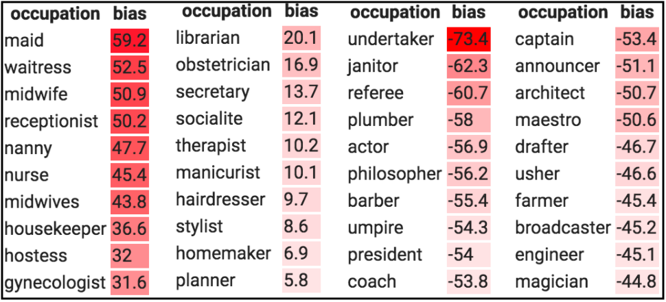

 

After the end of the Second World War, the Nuremberg trials laid bare the atrocities conducted in medical research by the Nazis. In the aftermath of the trials, the medical sciences established a set of rules — The Nuremberg Code — to control future experiments involving human subjects. The Nuremberg Code has influenced medical codes of ethics around the world, as has the exposure of experiments that had failed to follow it even three decades later, such as the infamous [Tuskegee syphilis experiment](https://en.wikipedia.org/wiki/Tuskegee_syphilis_experiment).

The direct negative impact of AI experiments and applications on users isn’t quite as inhumane as that of the Tuskegee and Nazi experimentations, but in the face of an overwhelming and growing body of evidence of algorithms being biased against certain demographic cohorts, it is important that a dialogue takes place sooner or later. AI systems can be biased based on who builds them, the way they are developed, and how they’re eventually deployed. This is known as algorithmic bias.

While the data sciences have not developed a Nuremberg Code of their own yet, the social implications of research in artificial intelligence are starting to be addressed in some curricula. But even as the debates are starting to sprout up, what is still lacking is a discipline-wide discussion to grapple with questions of how to tackle societal and historical inequities that are reinforced by AI algorithms.

We are flawed creatures. Every single decision we make involves a certain kind of bias. However, algorithms haven’t proven to be much better. Ideally, we would want our algorithms to make better-informed decisions devoid of biases so as to ensure better social justice, i.e., equal opportunities for individuals and groups (such as minorities) within society to access resources, have their voices heard, and be represented in society.

When these algorithms do the job of amplifying racial, social and gender inequality, instead of alleviating it; it becomes necessary to take stock of the ethical ramifications and potential malevolence of the technology.

This essay was motivated by two flashpoints : the racial inequality discussion that is now raging on worldwide, and Yann LeCun’s altercation with Timnit Gebru on Twitter which was caused due to a disagreement over a downsampled image of Barack Obama (left) that was depixelated to a picture of a white man (right) by a face upsampling machine learning (ML) model.

The (rather explosive) argument was sparked by this tweet by LeCun where he says that the resulting face was that of a white man due to a bias in data that trained the model. In simple terms, LeCun said that the results could be improved by increasing the number of black faces that the model sees. Gebru responded sharply that the harms of ML systems cannot be solely reduced to biased data. 

<blockquote class="twitter-tweet" data-theme="dark">
ML systems are biased when data is biased. This face upsampling system makes everyone look white because the network was pretrained on FlickFaceHQ, which mainly contains white people pics. Train the *exact* same system on a dataset from Senegal, and everyone will look African. <a href="https://t.co/jKbPyWYu4N">https://t.co/jKbPyWYu4N</a>
&mdash; Yann LeCun (@ylecun) <a href="https://twitter.com/ylecun/status/1274782757907030016?ref_src=twsrc%5Etfw">June 21, 2020</a></blockquote> 

 

In most baseline ML algorithms, the model fits better to the attributes or patterns that occur most frequently across various data points. For example, if you were to design an AI recruiting tool to review the résumés of applicants for a software engineering position, you would first need to train it with a dataset of past candidates which contains details like “experience”, “qualifications”, “degree(s) held”, “past projects” etc. For every datapoint, the algorithm of the hiring tool would need a decision or a “label”, so as to “learn” how to make a decision for a given applicant by observing patterns in their résumé.

For an industry where the gender disparity in representation is large, it is reasonable to assume that a large majority of the data points will be male applicants. And this collective imbalance in the data ends up being interpreted by the algorithm as a useful pattern in the data rather than undesirable noise which is to be ignored. Consequently, it teaches itself that male candidates are more preferable than female candidates.

I wish that this was merely an imaginary, exaggerated example that I used to prove my point. [It is not.](https://in.reuters.com/article/amazon-com-jobs-automation/insight-amazon-scraps-secret-ai-recruiting-tool-that-showed-bias-against-women-idINKCN1MK0AH)

LeCun wasn’t wrong in his assessment because in the case of that specific model, training the model on a dataset that contains faces of black people (as opposed to one that contains mainly white faces) would not have given rise to an output as absurd as that. But the upside of the godfather of modern AI getting dragged into a spat (albeit unfairly) has meant that more researchers will now be aware of the implications of their research.

The misunderstanding clearly seems to emanate from the interpretation of the word “bias” — which in any discussion about the social impact of ML/AI seems to get crushed under the burden of its own weight.

As Sebastian Raschka puts it, “the term **bias** in ML is heavily overloaded”. It has multiple senses that can all be mistaken for each other.

(1) **bias** (as in mathematical **bias** unit)  (2) “Fairness” **bias** (also called societal **bias**)  (3) ML **bias** (also known as inductive **bias**, which is dependent on decisions taken to build the model.)  (4) **bias**-variance decomposition of a loss function  (5) Dataset **bias** (usually causing 2)

I imagine that a lot of gaps in communication could be covered by just being a little more precise when we use these terms.

On a lighter note, never mind Obama, the model even depixelized a **dog’s face** to a caucasian man’s. It sure loves white males.

 

<blockquote class="twitter-tweet" data-theme="dark">
This is how that depixelizing algorithm reconstructed my dog, Tank <a href="https://t.co/XHgdNwRmXy">pic.twitter.com/XHgdNwRmXy</a>
&mdash; Jiahao Chen @ 🏡🗽 (@acidflask) <a href="https://twitter.com/acidflask/status/1274889347356069888?ref_src=twsrc%5Etfw">June 22, 2020</a></blockquote> 

 

Learning algorithms have inductive biases going beyond the biases in data too, sure. But if the data has a little bias, it is amplified by these systems, thereby causing high biases to be learnt by the model. Simply put, creating a 100% non-biased dataset is practically impossible. Any dataset picked by humans is cherry-picked and non-exhaustive. Our social cognitive biases result in inadvertent cherry-picking of data. This biased data, when fed to a data-variant model (a model whose decisions are heavily influenced by the data it sees) encodes these societal, racial, gender, cultural and political biases and bakes them into the ML model.

These problems are exacerbated, once they are applied to products. A couple of years ago, Jacky Alciné [pointed out](https://twitter.com/jackyalcine/status/615329515909156865) that the image recognition algorithms in [Google Photos were classifying his black friends as “gorillas.”](https://www.wired.com/story/when-it-comes-to-gorillas-google-photos-remains-blind/) Google apologised for the blunder and assured to resolve the issue. However, instead of coming up with a proper solution, it simply blocked the algorithm from identifying gorillas at all.

It might seem surprising that a company of Google’s size was unable to come up with a solution to this. But this only goes to show that training an algorithm that is consistent and fair isn’t an easy proposition, not least when it is not trained and tested on a diverse set of categories that represent various demographic cohorts of the population proportionately.

<blockquote class="twitter-tweet" data-theme="dark">
Facial recognition is the prime example. Amazon&#39;s Rekognition correctly identifies light-skinned males with an accuracy of 99% but the accuracy drops drastically for females, who are identified as men 19% of the time. It mistakes dark-skinned women for men 39% of the time.
&mdash; Karan (@IntrepidIndian) <a href="https://twitter.com/IntrepidIndian/status/1136048103008690176?ref_src=twsrc%5Etfw">June 4, 2019</a></blockquote> 

 

[Another disastrous episode](https://www.npr.org/2020/06/24/882683463/the-computer-got-it-wrong-how-facial-recognition-led-to-a-false-arrest-in-michig) of facial recognition tech getting it terribly wrong came as recently as last week when a faulty facial recognition match led to a Michigan man’s arrest for a crime he did not commit. Recent studies by [M.I.T.](https://www.nytimes.com/2018/02/09/technology/facial-recognition-race-artificial-intelligence.html) and the [National Institute of Standards and Technology](https://www.nytimes.com/2019/12/19/technology/facial-recognition-bias.html), or NIST, found that even though face recognition works well on white men, the results are not good enough for other demographics (the misidentification ratio can be more than 10 times worse), in part because of a lack of diversity in the images used to develop the underlying databases.

Problems of algorithmic bias are not limited to image/video tasks and they manifest themselves in language tasks too.

[Language is always “situated”](https://web.stanford.edu/~mjkay/LifeOfLanguage.pdf), i.e., it depends on external references for its understanding and the receiver(s) must be in a position to resolve these references. This therefore means that the text used to train models carries latent information about the author and the situation, albeit to varying degrees.

Due to the situatedness of language, any language data set inevitably carries with it a demographic bias. For example, some speech to text transcription models tend to have higher error rates for African Americans, Arabs and South Asians as compared to Americans and Europeans. This is because the corpus that the  speech recognition models are trained are dominated by utterances of people from western countries. This causes the system to be good at interpreting European and American accents but subpar at transcribing speech from other parts of the world.

Another example in this space is the gender biases in existing word embeddings (which are learned through a neural networks) that show females having a higher association with “less-cerebral” occupations while males tend to be associated with purportedly “more-cerebral” or higher paying occupations.

<blockquote class="twitter-tweet" data-conversation="none" data-theme="dark">
For instance - in existing embeddings, it&#39;s observed that women &amp; men are associated with different professions, with men associated with leaderships roles and professions like doctor, programmer and women closer to professions like receptionist or nurse.
&mdash; Karan (@IntrepidIndian) <a href="https://twitter.com/IntrepidIndian/status/1134415294162538497?ref_src=twsrc%5Etfw">May 31, 2019</a></blockquote> 

&nbsp;

In the table below, we see the gender bias scores associated with various occupations in the [Universal Sentence Encoder](https://www.tensorflow.org/hub/modules/google/universal-sentence-encoder/1) embedding model. The occupations with positive scores are female-biased occupations and ones with negative scores are male-biased occupations.

For ML Researchers it would be easy to punt the blame and absolve themselves of all responsibility, but it is imperative for them to acknowledge that they—knowingly or otherwise—build the base layer of AI products for a lot of companies that are devoid of AI expertise. These companies, without the knowledge of fine-tuning and tweaking models, use pre-trained models, as they are, put out on the internet by ML researchers (for e.g. - models like GloVe, BERT, ResNet, YOLO etc). 

Deploying these models without explicitly recalibrating them to account for demographic differences can thus lead to issues of exclusion and overgeneralisation of people along the way. The buck stops with the researchers who must own up responsibility for the other side of the coin.

It is also easy to blame the data and not the algorithm. (It reminds me of the Republican stance on the second amendment debate : “Guns don’t kill people, people kill people.”) Pinning the blame on just the data is irresponsible and akin to saying that the racist child isn't racist because he was taught the racism by his racist father. 

More than we need to improve the data, it is the algorithms that need to be made more robust, less sensitive and less prone to being biased by data that is skewed. This needs to be a responsibility for anyone who does research. In the meantime, de-bias the data.

The guiding question for deployment of algorithms in the real world should always be “would a false answer be worse than no answer?”

&nbsp;

------

*Thanks to Nayan K, [Naga Karthik](https://twitter.com/naga_karthik7) and Bina Praharaj for reviewing drafts of this.*

-----

&nbsp;

## References

&nbsp;

1) [Facial Recognition Is Accurate, if You’re a White Guy]([)https://www.nytimes.com/2018/02/09/technology/facial-recognition-race-artificial-intelligence.html) by Steve Lohr

2) Krishnapriya, KS., Vangara, K., King, M., Albiero, V., Bowyer, K. [Characterizing the Variability in Face Recognition Accuracy Relative to Race](https://arxiv.org/pdf/1904.07325.pdf) in *The IEEE Conference on Computer Vision and Pattern Recognition (CVPR) Workshops, June 2019.*

3) [Life of Language](https://web.stanford.edu/~mjkay/LifeOfLanguage.pdf) by Martin Kay, Stanford University

4) [Text Embedding Models Contain Bias. Here's Why That Matters.](https://developers.googleblog.com/2018/04/text-embedding-models-contain-bias.html) by Ben Packer, Yoni Halpern, Mario Guajardo-Céspedes & Margaret Mitchell, Google AI

5) Bolukbasi, T., Chang, KW., Zou, J., Saligrama, V., Kalai, A. [Man is to Computer Programmer as Woman is to Homemaker? Debiasing Word Embeddings](http://papers.nips.cc/paper/6228-man-is-to-computer-programmer-as-woman-is-to-homemaker-d) in *Advances in Neural Information Processing Systems 29, 2016.*

&nbsp;

## 

