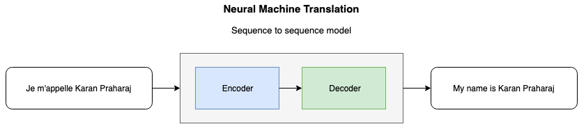
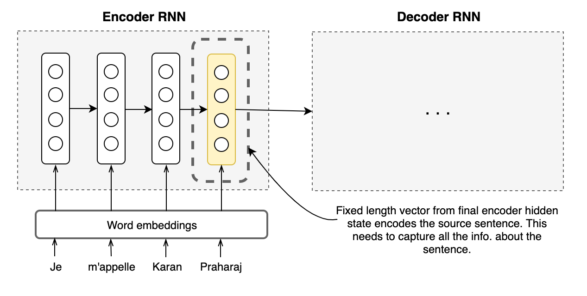
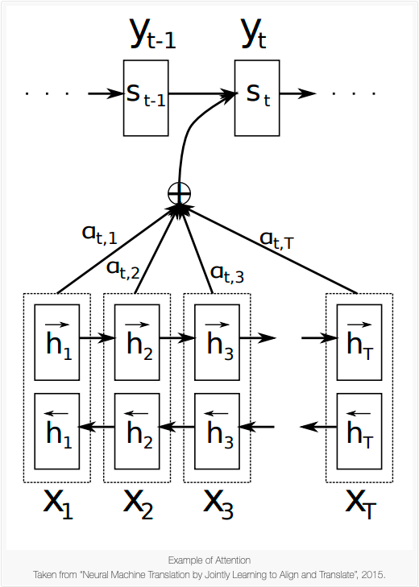

+++
title = "Attention for Machine Translation"
subtitle = ""

math = true

# Add a summary to display on homepage (optional).
summary = "A brief round-up of the attention mechanism for neural machine translation models."

date = 2019-04-08T13:21:02+02:00
draft = false

# Authors. Comma separated list, e.g. `["Bob Smith", "David Jones"]`.
authors = ["Karan Praharaj"]

# Is this a featured post? (true/false)
featured = true

# Tags and categories
# For example, use `tags = []` for no tags, or the form `tags = ["A Tag", "Another Tag"]` for one or more tags.
tags = ["Deep Learning", "Natural Language Processing"]
categories = ["Computer Science"]

# Projects (optional).
#   Associate this post with one or more of your projects.
#   Simply enter your project's folder or file name without extension.
#   E.g. `projects = ["deep-learning"]` references 
#   `content/project/deep-learning/index.md`.
#   Otherwise, set `projects = []`.
# projects = ["internal-project"]

# Featured image
# To use, add an image named `featured.jpg/png` to your page's folder. 
[image]
  # Caption (optional)
  caption = ""

  # Focal point (optional)
  # Options: Smart, Center, TopLeft, Top, TopRight, Left, Right, BottomLeft, Bottom, BottomRight
  focal_point = ""
+++

We are not cerebrally hardwired to process loads of information at once. However, what we *are* good at, is focusing on a part of the information we're given to make sense of it.  When asked to translate a sentence from one language to another, you process the sentence by picking up individual words as you go, skewering them together into phrases and then mentally assigning corresponding words/phrases in the target language for each part. When a written word is presented to you for translation, it kicks off a series of neurocognitive processes in your brain. Your normal language system in the brain reads the word in your native language, but for translation, this usual tendency must be suppressed so the translated meaning can emerge. A specific region of the brain (known as the "caudate nucleus") coordinates this activity, much like an orchestral conductor, to produce stunningly complex behaviours. Essentially, the syntactical, phonological, lexical and semantic aspects of the word or sequence of words are encompassed, assimilated and then contextualized to render the said sequence of words into its equivalent in the target language. 

Translations - be it by human or by machine - are not objective in their character, which is to say that there is no *unique* translation for any given sentence. Human translation inherently carries the risk of introducing source-language words, grammar or syntax into the target language rendering. A translation by two humans of a relatively long sentence can rarely ever be the exact same. Despite the variance in the final result, though, what does not change is the broad process by which the translations were arrived at. For any target-language word or phrase that was rendered in the translation, the translator paid attention to some parts of the source sentence more than others.  

This innate quality of humans had not been given to machine algorithms until 2015, when Bahdanau, Cho and Bengio introduced the "attention" mechanism. This mechanism was proposed to maximise translation performance by allowing a model to automatically (soft-)search for parts of a source sentence that are relevant to predicting a target word, without having to form these parts as a hard segment explicitly. I concede that this sentence may be hard to digest, but we will make sense of it by breaking it down and paying attention to parts of it one at a time. (Very meta, I know.) The impact of this 2015 paper was profound and it would go on to become the building block for several state-of-the-art models. 

 

#### Why do we need Attention?

In conventional neural machine translation models, an encoder-decoder combination is used with an encoder and a decoder for each language, or a language-specific encoder applied to each sentence whose outputs are then compared. An encoder RNN reads and encodes a source sentence into a fixed-length vector.  A decoder then spits out a translation based on the vector fed to it from the encoder. The whole encoder–decoder system, which consists of the encoder and the decoder for a language pair, is jointly trained to maximize the probability of a correct translation given a source sentence.

 

##### The Bottleneck

A problem with this architecture is its over-reliance on one fixed-length vector to encompass all the necessary information and be a good quality representation of the source sentence. This pressure on the fixed-vector vector to compress and capture all the information is a bottleneck and it makes it difficult for the encoder neural network to perform well on long sentences. It has been shown earlier that the performance of a basic encoder–decoder deteriorates rapidly as the length of an input sentence increases.

&nbsp;

#### Core Idea 

In order to address the issue, Bahdanau et al. introduced an extension to the encoder-decoder model which learns to align and translate jointly. The new architecture deploys a bidirectional-RNN as an encoder and a decoder that will be able to focus on all hidden states instead of just the final hidden state. What this modification does, is afford the decoder a flexibility in decision-making and therefore identify the parts of the source sentence that may be more relevant for the prediction of the next word in the target sentence. This is the intuition of the attention mechanism, and it leads us now to the mathematics that goes into making this happen. 

#### The Algebra Involved

In the basic encoder-decoder RNN framework, the decoder is trained to predict the next word $y\_t$ , given the context vector $c$ and all the words that have been predicted in previous time steps {$y\_1$,…,$y\_{t^{'}-1}$,$c$}

In the new model architecture however, the probability is conditioned on a distinct context vector $c_i$ for each target word $y\_t$. 

The probability over translation $y$ is defined as :
$$p(\textbf{y}) = \prod_{t=1}^{T} p(y\_t|\{y\_1,...,y\_{t-1}\},c\_i)\tag{1}$$
where $\textbf{y}$ is the output (predicted translation). The condition probability in (1) is defined as : 
$$p(y\_i| \{y\_1,...,y\_{t-1}\}, \textbf{x})) = g(y\_{i-1},s\_i,c\_i) \tag{2}$$

where $\textbf{x}$ is the source sentence and $s\_i$ is an RNN hidden state for timestep $i$ determined by $s\_i = f(s\_{i-1},y\_{i-1},c\_i)$ .

The source sentence is mapped by the encoder to a sequence of annotations, $h\_1,…h\_{T\_x}$, whose weighted sum is computed to obtain the context vector $c\_i$. Each annotation encapsulates information about the entire input sequence with a strong focus on the parts surround the $i^{th}$ word of the input sequence.

The encoder is a bidirectional-RNN, and so the annotations for each word $x_j$ are obtained by concatenating the forward hidden state $\vec{h}\_j$ along with the backward one $\overleftarrow{h}\_j$ , i.e. $h\_j = \bigg[\vec{h_j^T} ;\overleftarrow{h\_j^T}\bigg]$. This representation of inputs helps contain important bits of information from words in the neighbourhood of $x\_j$.

 

Now that we have established the idea of annotations, we can proceed to discuss the computation of the context vectors $c\_i$. The context vector is computed as the weight sum of annotations : 
$$ c\_i = \sum\_{j=1}^{T\_x}\alpha\_{ij}h\_{j}\tag{3} $$
The weight $\alpha$ corresponding to each annotation $h_j$ is calculated by taking  softmax over the attention scores:
$$ \alpha\_{ij} = \frac{exp(e\_{ij})}{\sum\_{k=1}^{T\_x}exp(e\_{ik})}, \tag{4} $$
where 
$$ e\_{ij} = a(s\_{i-1},h\_{j}) $$
is a scoring model which quantifies how strong the inputs around position $j$ and output at position $i$ align. The alignment model directly computes a soft alignment, which allows the gradient of the cost function to be backpropagated through. This gradient can be used to train the alignment model as well as the whole translation model jointly.

Thus, this new approach facilitates the information to be spread across the sequence of annotations, which can be selectively retrieved by the decoder accordingly. 

By medium of language, we manage to communicate ideas over long ranges of space and time, but the creation of syntactic bonds between words in a sentence that may or may not be in close proximity to each other, underpins expression of ideas in any language. This is where attention steps in and aids the mapping of syntaxes from the source language to the target language. To identify relationships of words with other words that maybe far away in the same sentence — all while ignoring other words that just do not have much influence on the word we're trying to predict — that is what attention aims to do.

-----

&nbsp;

## References

[1]	Bahdanau, D., Cho, K. & Bengio, Y. <a href = http://arxiv.org/abs/1409.0473>Neural machine translation by jointly learning to align and translate. </a> In <i>Proc. International Conference on Learning Representations</i> (2015)

[2]	Cho, Kyunghyun, Aaron Courville, and Yoshua Bengio. <a href = http://arxiv.org/abs/1507.01053>Describing Multimedia Content using Attention-based Encoder–Decoder Networks.</a>  &nbsp  (2015)

[3]	Sutskever, I. Vinyals, O. & Le. Q. V. <a href =  https://papers.nips.cc/paper/5346-sequence-to-sequence-learning-with-neural-networks.pdf> Sequence to sequence learning with neural networks.</a> In <i>Proc. Advances in Neural Information Processing Systems.</i> (2014)

[4]	Chris Olah's blog post. <a href = https://distill.pub/2016/augmented-rnns/>"Attention and Augmented Recurrent Neural Networks" 
 
